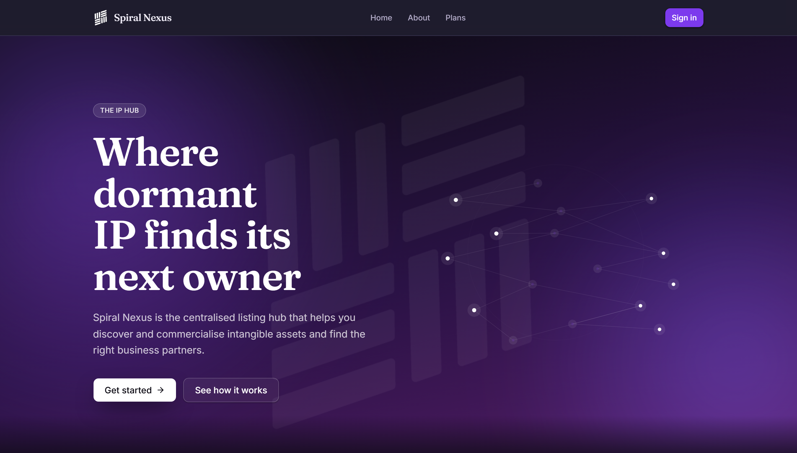
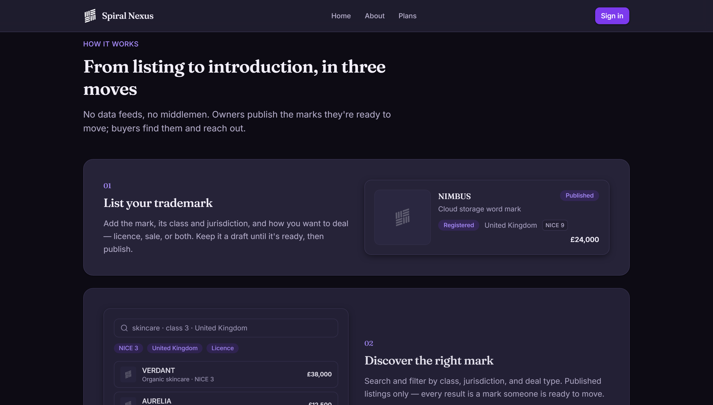

# Spiral Nexus

**A marketplace where dormant intellectual property finds its next owner.** List trademarks and IP assets, discover them through search and filtering, and connect directly with buyers and sellers, no data feeds, no middlemen.

**Live demo:** [spiral-nexus.vercel.app](https://spiral-nexus.vercel.app)




---

## Overview

Spiral Nexus is a two-sided marketplace for commercialising intangible assets (trademarks first, patents later). Owners publish the marks they are ready to move; buyers search, filter and reach out directly. Built solo from a founder's concept to a working, deployed product.

## Features

- **List** a trademark with its class, jurisdiction and deal type (licence, sale or both), kept as a draft until it is ready to publish.
- **Discover** through search and filtering by class, jurisdiction and deal type, showing published listings only.
- **Message** counterparties directly through a persistent docked messaging panel.
- **Follow and save** via a social graph: follow owners, save listings, and like marks.
- **Subscribe** with tier-gated access; while payments are disabled, every signed-in user gets a bounded MVP allowance so the free tier stays usable.

## Tech stack

Next.js 16 (App Router) · React 19 · TypeScript · Tailwind CSS v4 · Supabase (Postgres, Auth, Row-Level Security) · Zod + React Hook Form · Base UI · Stripe (subscriptions) · deployed on Vercel.

## Architecture highlights

- **Row-Level Security enforcing per-user data isolation** at the database layer, so access rules are enforced in Postgres, not just in application code.
- **Versioned SQL migrations as the source of truth** (`supabase/migrations`), the database is treated as code with a reviewable history.
- **Vertical-slice delivery**, each capability (listings, messaging, discovery, social, subscriptions) shipped end to end: schema, security policy, server logic and UI.
- **Type-safe throughout**, strict TypeScript with Zod validation at the boundaries.
- **Quality gates**, ESLint and a pre-commit hook keep the main branch clean.

## Getting started

> Prerequisites: Node.js 20.19+ (or 22.13+ / 24+) and a free Supabase project.

```bash
# 1. Install dependencies
npm install

# 2. Configure environment
cp .env.example .env.local
```

Then fill in `.env.local` (from your Supabase project's Settings -> API):

- `NEXT_PUBLIC_SUPABASE_URL` and `NEXT_PUBLIC_SUPABASE_ANON_KEY`
- `SUPABASE_SERVICE_ROLE_KEY` (server only, keep secret)
- Stripe keys can stay blank while `PAYMENTS_ENABLED=false`

```bash
# 3. Apply the database schema
#    run supabase/migrations/0001_init.sql in the Supabase SQL editor,
#    or use the Supabase CLI:
npm run db:push

# 4. Run the app
npm run dev
```

Open [http://localhost:3000](http://localhost:3000).

## Project layout

- `app/(marketing)` - public pages (home, about, plans)
- `app/(auth)` - authentication
- `app/(app)` - authenticated surface (dashboard, listings, messages)
- `components/`, `design-system/` - UI components and the design system
- `lib/` - Supabase clients, tier definitions, shared types
- `supabase/migrations` - database schema (source of truth)
- `docs/MVP-SPEC.md` - product spec and build plan

## Status

Actively developed. Core marketplace flows (listing, discovery, messaging, social, subscriptions) are live in the deployed demo. Patents and additional deal workflows are on the roadmap.

## Author

**Samuel Tedros** - sole architect and developer.
[LinkedIn](https://www.linkedin.com/in/samueltedros) · [GitHub](https://github.com/s4lt3dd)
