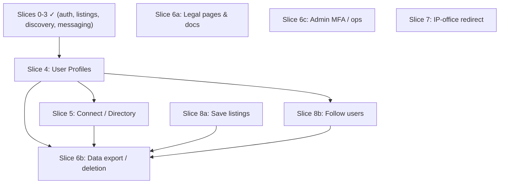

# Spiral Nexus — Roadmap to the LOI MVP ("Level 0")

> **Status (Aug 2026): this phase is COMPLETE.** Every slice below (0–3 plus
> 4, 5, 6a/b/c, 7, 8a, 8b) has shipped and merged (PRs #1–#13), along with a
> post-MVP polish wave: real-time messaging, a docked messaging panel, the
> engagement layer (likes, activity, notifications), the country/sector
> filters, the authoritative dark theme + brand assets, and a unit-test suite
> with CI. The sections below are kept as the **historical build plan and the
> parallel-execution record** — read them for context, not as a to-do list.
> Live deferred work now lives in the CLAUDE.md "Still deferred" list.

Optimised for **running multiple agents in parallel**. Each slice notes what it
depends on, what it can run alongside, and which files/tables it *owns* (the unit
of merge-conflict risk).

## Goal of this phase

A **free, invite-only pre-launch product** whose job is to collect sign-ups as
**Letters of Intent** for fundraising. Not the paid Launch product. Per the
founders: paywalls and verification are **deferred to Launch**; the MVP must let
invited users register, fill a profile, browse/list trademarks, and **find and
connect with each other** ("the simplest version of LinkedIn").

### Deferred to the real Launch (do NOT build now)
- Paywalls / Stripe (gating list count + DM limits)
- Verification / KYC badge workflow (manual or EIDV/IDVT)
- ML "Smart Matches", the Feed, trending, on-platform transactions

### Recommended pre-Launch fast-follow (founders' safety focus)
- Blocking / reporting on messaging (shipped without it; safety is their priority)

---

## Shipped (all slices) ✅
- **Slices 0–3:** auth (magic link) · trademark listings CRUD + dashboard ·
  discovery (browse/search/filter/detail) · 1:1 messaging. The core loop
  **list → discover → contact** works end to end.
- **Slice 4:** user profiles + profile-as-home.
- **Slice 5:** Connect / member directory.
- **Slice 6:** compliance & legal — 6a pages/docs, 6b data export & delete,
  6c admin MFA/ops.
- **Slice 7:** IP-office search redirect.
- **Slice 8:** light social — 8a save listings, 8b follow users.

The per-slice detail below is retained as the build record.

---

## Slice detail (as-built reference)

### Slice 4 — User Profiles + profile-as-home  ⟵ critical path
**Goal:** the logged-in home becomes the user's **profile** (their public identity);
new users are guided through a **profile-building onboarding**; existing users get a
**completion nudge** — while listings management stays one click away.
- **Depends on:** nothing (the `profiles` table already exists).
- **Owns / builds:**
  - migration extending `profiles` with the agreed fields (see *Schema contracts*).
  - **Data-driven nav/footer refactor** (links from a config array) as its FIRST
    commit — the foundation other slices add to (kills the nav merge-conflict).
  - Logged-in home = **your profile**: identity, a completeness meter, your published
    listings, quick links to Messages. **Relocate** the current listings-management
    view to a clear sub-route (e.g. `/dashboard/listings` / "My listings") —
    relocate, do **not** remove; update all links.
  - Public profile route (e.g. `/u/[id]`) showing identity + that user's published
    listings (the bridge between the "people" and "listings" halves).
  - **Onboarding** flow on first sign-in (multi-step profile build) + a
    **profile-completion nudge** for existing users.
  - profile form + `lib` + validation.
- **Shared touch-points:** `lib/types.ts`; it OWNS the new nav/footer config.
- **Why first:** the home page, onboarding, the Connect directory (5) and Follow (8b)
  all consume the profile fields + nav config, so this slice is the contract
  everything else builds on.

### Slice 5 — Connect / Member Directory
**Goal:** a browsable directory of signed-up users + the info they shared, linking
to public profiles. The mockup's `/network`, "simplest LinkedIn".
- **Depends on:** Slice 4 (profile fields + public profile route).
- **Owns:** `/network` directory page, member-card component, directory query lib.
- **Shared touch-points:** nav.
- **Parallel unlock:** can run *concurrently* with Slice 4 if the **profile schema
  is frozen first** (see "Schema contracts" below) — build against the contract,
  mock data until Slice 4 merges.

### Slice 6 — Compliance & Legal  (splittable)
- **6a — Legal pages & docs (fully independent, start now):** Privacy Policy +
  Terms of Use pages, footer links, `docs/compliance/subprocessors.md`,
  `docs/compliance/data-inventory.md`. Required for UK/EU + US even pre-launch.
- **6b — Data-subject rights (do LAST):** "export my data" + "delete my account"
  flows that read/delete across **all** tables.
  - **Depends on:** every schema-changing slice (4, 5, 8) being merged, so export/
    deletion covers everything.
- **6c — Admin MFA & ops (independent):** enable 2FA on Supabase/Vercel/GitHub;
  document it. Mostly config.
- **Owns:** `/privacy`, `/terms`, account-settings data actions, `docs/compliance/*`.
- **Shared touch-points:** footer.

### Slice 7 — IP-Office Redirect  (optional, fully independent)
**Goal:** the light version of the founders' "IP office data" ask — a search box
that deep-links a user's query out to USPTO / UKIPO / EUIPO / WIPO public search.
- **Depends on:** nothing. No schema, no shared models.
- **Owns:** a registries page/component + outbound-link config.

### Slice 8 — Light Social  (optional, splittable)
- **8a — Save listings:** `saved_listings` table + save button + saved page.
  - **Depends on:** listings (ready now). **Touches** the shared listing card.
- **8b — Follow users:** `follows` table + follow button on profiles.
  - **Depends on:** Slice 4.

---

## Dependency graph

`S6a`, `S6c`, `S7`, `S8a` have **no upstream dependency** — they can start
immediately and run alongside anything.

---

## Parallel execution plan (for concurrent agents)

### Wave 1 — start now, up to 4 agents at once
| Agent | Slice | Independent? |
|-------|-------|--------------|
| A | **Slice 4 — User Profiles + profile-as-home** (critical path) | yes |
| B | **Slice 6a — Legal pages & docs** | fully — no schema, no shared models |
| C | **Slice 7 — IP-office redirect** | fully |
| D | **Slice 8a — Save listings** | yes (only touches the listing card) |

`6c` (admin MFA) is config — fold into Agent B or do yourself anytime.

> **Nav ordering:** Slice 4 lands the data-driven nav/footer config as its first
> commit. Slices that add a nav/footer link (6a footer, 7, 8a's saved page) should
> branch *after* that commit merges, then just add a config entry — no JSX clash.

### Wave 2 — once Slice 4's profile schema + public route are merged (or its contract is frozen)
| Agent | Slice | Depends on |
|-------|-------|------------|
| E | **Slice 5 — Connect / Directory** | Slice 4 |
| F | **Slice 8b — Follow users** | Slice 4 |

### Wave 3 — once all schema-changing slices are merged
| Agent | Slice | Depends on |
|-------|-------|------------|
| G | **Slice 6b — Data export / deletion** | 4, 5, 8 |
| — | Integration / QA pass (cross-slice click-through, RLS re-verify) | all |

---

## Coordination rules (so parallel agents don't collide)

1. **One branch per slice off `main`, one PR per slice.** Merge to `main` as soon
   as each is reviewed — short-lived branches drift less.
2. **Each slice owns its own migration file(s); never edit another slice's.**
   Migrations are timestamped and additive, so parallel ones merge cleanly *as
   long as they don't alter the same table*. Only **Slice 4 alters `profiles`** —
   no other Wave-1 slice should touch it. New tables (`saved_listings`,
   `follows`) are conflict-free.
3. **Nav/footer is the #1 conflict hotspot** (`components/marketing/site-header.tsx`).
   **Slice 4 establishes a data-driven nav/footer (links from a config array) as its
   first commit.** Once merged, every other slice adds a config entry instead of
   editing the same JSX. Nav/footer-touching slices branch *after* that lands.
4. **Freeze the profile schema contract before Wave 1** if you want Slice 5 to run
   in parallel with Slice 4 (see below). Otherwise run Slice 5 in Wave 2.
5. **Append-only edits** to `CLAUDE.md` and `lib/types.ts` to minimise conflicts.
6. **Every slice ends with:** its verify script (RLS), `/security-review` on any
   server actions, `npm run build`, then PR. Same vertical-slice discipline.

### Schema contracts (the lever that unlocks more parallelism)
Before starting, decide the exact `profiles` columns — Slice 4 defines them and the
home page, onboarding, the Connect directory (5) and Follow (8b) all consume them.
Suggested fields beyond the basics: `headline`, `bio`, `org_name`, `role`/intent
(owner | buyer | licensee — multi), sector / Nice-class interests, `jurisdictions`,
`website`/links, `location`, plus a derived **completeness** value for the nudge.
Design them to feed the directory and future matchmaking, not just display. Write the
agreed columns into the Slice 4 plan up front; then 4, 5 and 8b can build against the
contract simultaneously (5/8b mock until 4 lands). No other slices share tables.

---

## Fastest realistic path
- **Day 1:** kick off Wave 1 (Agents A–D) in parallel. Land 6a, 7, 8a quickly
  (small, independent). Land Slice 4.
- **Day 2:** Wave 2 (Agents E, F) against the merged/contracted profile schema.
- **Day 3:** Slice 6b once everything that owns data has merged, then a QA pass.

The hard dependency is only **Profiles → (Connect, Follow, Data-deletion)**.
Everything else is parallelisable from the start.
